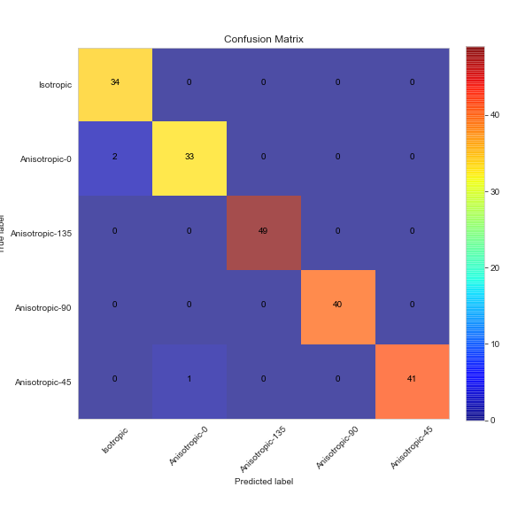
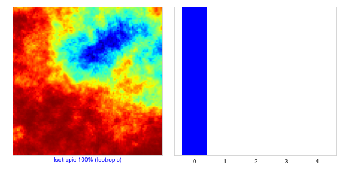
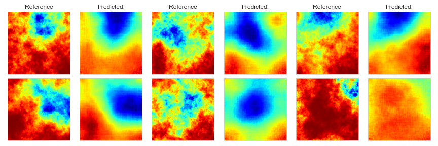
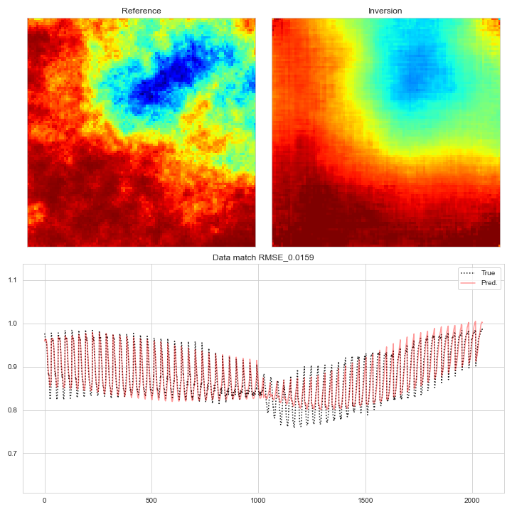

# geo-selection-inversion

Implementation for "Convolutional neural networks (CNN) for feature-based model calibration under uncertain geologic scenarios" by Mohd-Razak and Jafarpour (2020) as published in Computational Geosciences. In this [demo code](https://github.com/rsyamil/geo-selection-inversion/blob/main/mnist/geo-selection-inversion-demo.ipynb) for two-step scenario selection and inversion, we use the non-Gaussian binary digit-MNIST dataset and a linear forward model as the simulator. For nonlinear forward model (any of your choice or specific engineering application), simply replace `dataset.simulator` with the nonlinear simulation function. Refer [here](https://github.com/rsyamil/cnn-regression) for more information on this dataset.

## Step 1 : Scenario selection

The class labels of the digit-MNIST dataset represent the multiple possible scenarios of priors. Before performing direct model calibration or inversion, the correct identification or selection of relevant scenarios can help reduce computational cost associated with running forward simulations. As an example, running forward simulation on priors belonging to class label "8" can be avoided if we can identify the relevant scenarios (i.e. class labels) from the observed data `d_obs` (sampled as a reference case from class label "7"). To that end, the priors from multiple scenarios are sparsely sampled (as per `sample_ratio`) and the simulation is performed on this set of samples to collect the response data. 

A classifier is then trained using the response data with their associated class labels. The confusion matrix above shows that the classifer can correctly identify the class labels for a set of validation data.  

For this particular reference `d_obs`, the classifier identifies the class scenario as class "7" with 100% likelihood. Next, we will resample the priors for the second step, according to the proportion (i.e. likelihood) identified by the classifier. In this case, 100% of the resampled priors will come from class "7", increasing the performance of the second step when only relevant scenarios are considered.   

## Step 2 : Model inversion

In the second step, we take the set of resampled priors from only relevant scenarios and collect the response data to train a regression model to perform direct inversion (i.e. predict the model from the response data). For a randomly sampled validation dataset, the histogram below compares the cell (i.e. pixel) values of the relevant validation priors to the predictions (i.e. inversions) from the regression model. 

Comparison of randomly sampled reference cases to their inversion obtained from the regression model. 

For this particular reference `d_obs`, the inversion is shown below. We then take the inversion model and put it through the simulator and check if it's able to reproduce `d_obs`.

In this demo, we ran 6000 simulations for scenario selection and another 6000 simulations for model inversion. The computational cost saving is evident (note that in practical cases, each simulation run can take many hours) when we compare this to running 60,000 forward simulations on the entire training dataset, or 6000 simulations for model inversion using potentially irrelevant scenarios that will reduce the inversion quality. 
