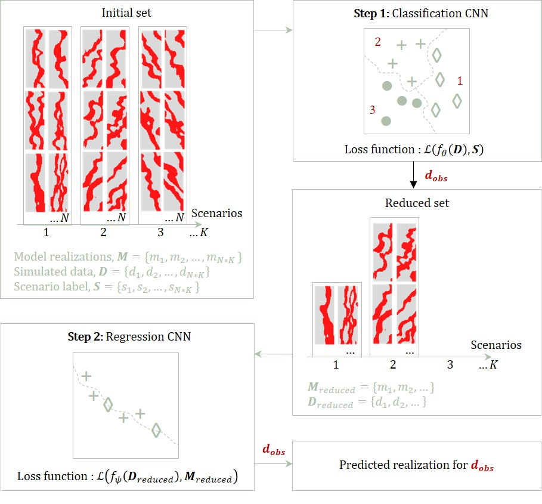

# geo-selection-inversion

Implementation and demo for "Convolutional neural networks (CNN) for feature-based model calibration under uncertain geologic scenarios" by Mohd-Razak and Jafarpour (2020) as published in Computational Geosciences. The paper presents convolutional neural network architectures for integration of dynamic flow response data to reduce the uncertainty in geologic scenarios and calibrate subsurface flow models.

```
geo-selection-inversion 
│
└─── mnist
│   
└─── 2d-gaussian
│   
└─── 2d-fluvial
```
Demos based on the MNIST dataset, a 2D gaussian field dataset and a 2D fluvial field dataset (see folder structure) are archived in this repository.

## Workflow

The workflow consists of two steps:
* **Step 1**: Reduce the solution search space by eliminating unlikely geologic scenarios using distinguishing salient flow data trends, using a classifier CNN. The first step serves as a pre-screening to remove unsupported scenarios from the full model calibration process in the second step.
* **Step 2**: Perform model calibration using the selected geologic scenarios, using a regression CNN. The regression CNN model learns the inverse mapping from the production data space to the lowrank representation of the model realizations within the feasible set. 
Once the model is trained off-line, a fast feed-forward operation on the observed historical production data (input `d_obs`) is used to reconstruct a calibrated model. 



The presented approach offers an opportunity to utilize flow data in identifying plausible geologic scenarios, results in an off-line implementation that is conveniently parallellizable, and can generate calibrated models in real time, i.e., upon availability of data and without in-depth technical expertise about model calibration. Computational efficiency is achieved by pruning irrelevant scenarios before the model calibration step.  
